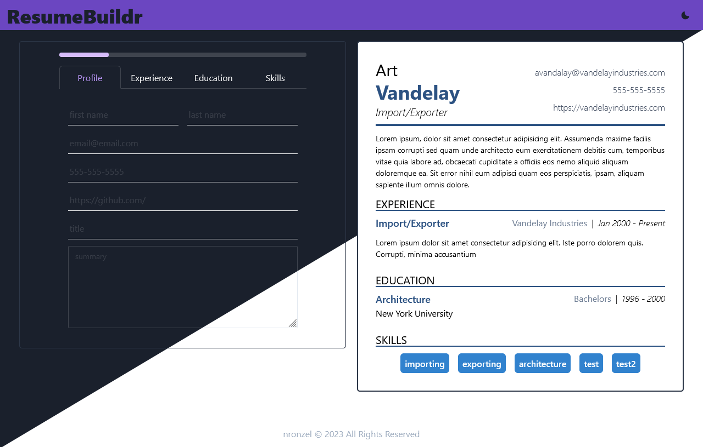

# Resume Maker    

## Description

Fill out the form and it will display the text on the resume.

This project is from The Odin Project cirriculum. The purpose of the project was to practice using React state and props.

I learned a lot from this project, especially in regards to how React works at a basic level, how to work with state without mutating it directly, how to pass state down the component tree, and how to pass methods around to different components to modify state in a child component.

I also learned the benefits of using a pre-styled component library (Chakra UI) and how it can help significantly speed up the developement of a website.

## Installation

1. Clone the respository locally
2. Install dependencies

```
npm install
```

3. Run the dev server by running

```
npm run dev
```

4. View the site in your browser (port will be displayed in console when you run `npm run dev`)

```
localhost:5173
```

To build and preview the production build of the app:

```js
npm run build // builds the production version and creates the /dist/ folder
npm run preview // run preview of the production build. default: localhost:4173
```

## Usage

[LIVE PREVIEW](https://nronzel.github.io/resume-maker/)


